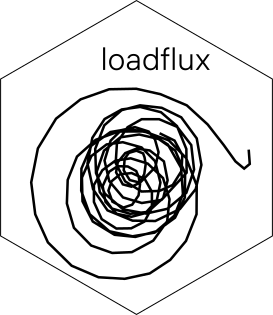

<!-- README.md is generated from README.Rmd. Please edit that file -->

```{r, include = FALSE}
knitr::opts_chunk$set(
  collapse = TRUE,
  comment = "#>",
  fig.path = "man/figures/README-",
  out.width = "100%"
)
```

# loadflux 


<!-- badges: start -->
[](https://codecov.io/gh/atsyplenkov/loadflux)
<!-- badges: end -->

The goal of `loadflux` is aimed at comprehensive analysis of the intra-event suspended sediment dynamics.

## Installation

<!-- CRAN -->
You can install the released version of loadflux from [CRAN](https://CRAN.R-project.org) with:

``` r
install.packages("loadflux")
```
<!-- CRAN -->

You can install the development version from [GitHub](https://github.com/) with:

``` r
# install.packages("devtools")
devtools::install_github("atsyplenkov/loadflux")
```
## Example

This is a basic example which shows you how to split your series into hydrological events:

```{r example, message=FALSE, warning=FALSE}
library(dplyr)
library(loadflux)
## basic example code
data(djan)

djan %>% 
  hydro_events(q = discharge,
              datetime = time,
              window = 21)
```

Then you can explore created hydrological events via `event_plot` function

```{r interactive_plot, message=FALSE, warning=FALSE}

plot <- djan %>% 
  hydro_events(q = discharge,
              datetime = time,
              window = 21) %>%
  event_plot(q = SS, datetime = time, he = he)

```

