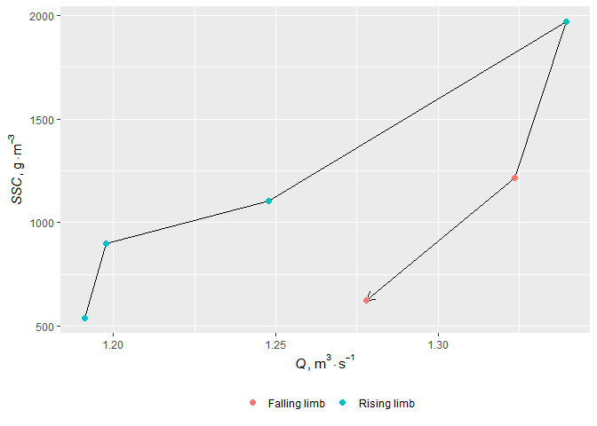

<!-- README.md is generated from README.Rmd. Please edit that file -->

# loadflux 

<!-- badges: start -->

[](https://codecov.io/gh/atsyplenkov/loadflux)
[](https://github.com/atsyplenkov/loadflux/actions)
[](https://www.repostatus.org/#wip)
<!-- badges: end -->

The `loadflux` package is build for the comprehensive analysis of the
intra-event suspended sediment dynamics.

## Installation

<!-- CRAN
You can install the released version of loadflux from [CRAN](https://CRAN.R-project.org) with:

``` r
install.packages("loadflux")
```
 -->

You can install the development version from
[GitHub](https://github.com/) with:

``` r
# install.packages("devtools")
devtools::install_github("atsyplenkov/loadflux")
```

## Example

This is a basic example which shows you how to split your series into
hydrological events:

``` r
library(dplyr)
library(loadflux)
data(djan)

df <- djan %>% 
  hydro_events(q = discharge,
               datetime = time,
               window = 21)

head(df)
#> # A tibble: 6 x 4
#>      he time                discharge    SS
#>   <dbl> <dttm>                  <dbl> <dbl>
#> 1     1 2017-06-06 12:00:00     0.778  227.
#> 2     1 2017-06-06 13:00:00     0.778   NA 
#> 3     1 2017-06-06 14:00:00     0.778  224.
#> 4     1 2017-06-06 15:00:00     0.778   NA 
#> 5     1 2017-06-06 16:00:00     0.778  271.
#> 6     1 2017-06-06 17:00:00     0.925   NA
```

### Plots

Then you can plot the hysteresis loop by running `hysteresis_plot`

``` r
library(ggplot2)

df %>% 
  filter(he == 2) %>%
  hysteresis_plot(q = discharge,
                  ssc = SS,
                  base_font_size = 14)
```



### Hyseteresis indexes

This package also contains several function for hysteresis index
calculation:

**Added**

-   `SHI` - Simple Hystersis Index from [*Tsyplenkov et al.,
    2020*](https://link.springer.com/article/10.1007/s11368-020-02633-z)
-   `AHI` - Aich’s Hysteresis Index from [*Aich et al.,
    2014*](https://www.sciencedirect.com/science/article/abs/pii/S0341816214001969)

**Pending**

-   `HImid` - Hysteresis Index from [*Lawler et al.,
    2006*](https://www.sciencedirect.com/science/article/abs/pii/S0048969705005711)

To calculate a hysteresis index for your event run as follows:

``` r
df %>% 
  filter(he == 2) %>% 
  SHI(q = discharge,
      ssc = SS)
#> [1] 0.2473604
```
